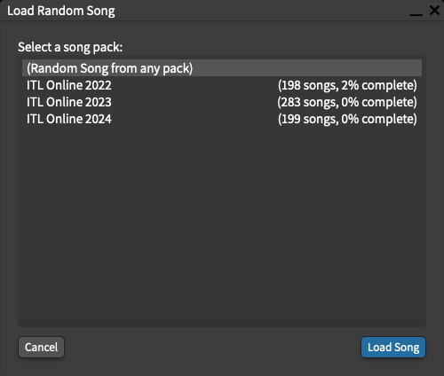
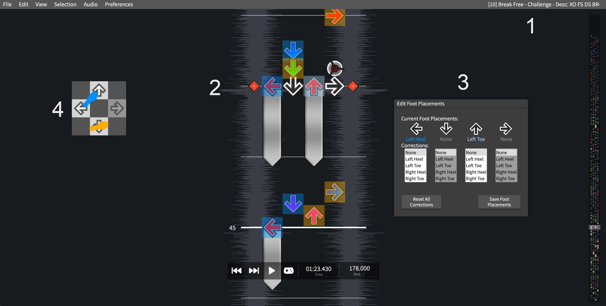
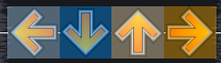
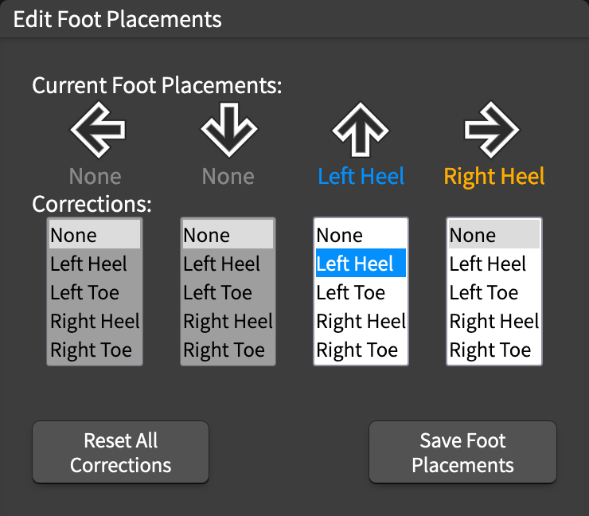
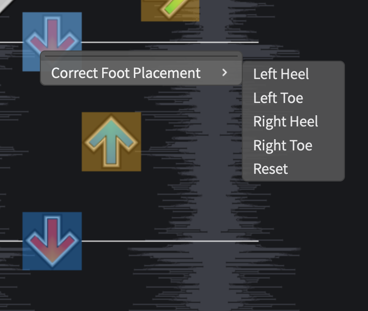
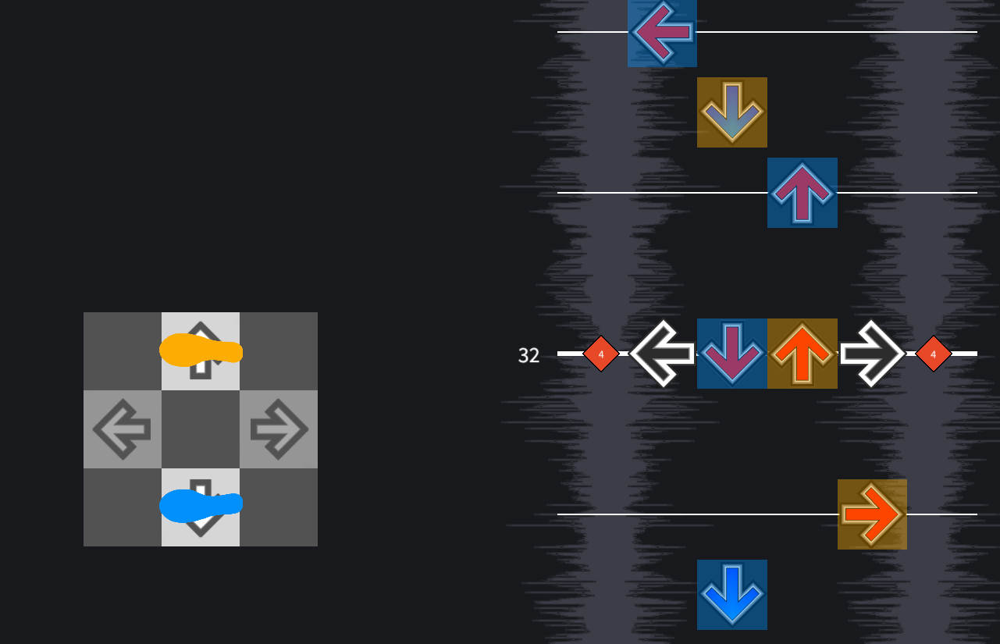
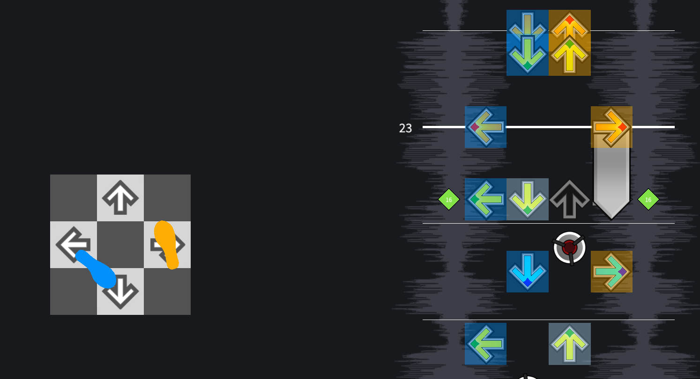
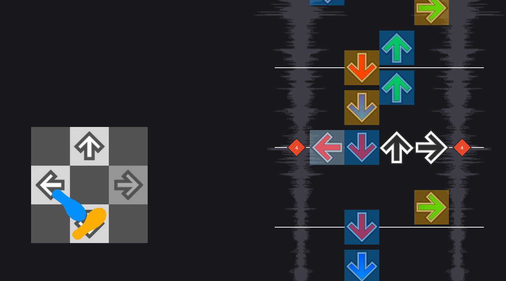

# Annotating Step Charts 

The main goal of this project is to refine an algorithm for predicting foot placements for a step chart. In order to do that, I need to collect a bunch of data on what "correct" foot placements look like.

I quickly realized that this is way too much work for me to do on my own, so I built this application to make it as simple as I could to get others to help me out. All song data is loaded from a remote database, and corrections are saved back to that database. Once I've collected all the data that I need, I'll make it all publicly available for others to use.

## How does this thing work?

When you open the app, it'll give you the option to either load a completely random song, or load a random song from a particular pack:

 It'll then load a song and provide you with it's best guess at foot placements. Your job is to check the step chart and correct any foot placements that don't make sense. When you're happy with it, click "Save Foot Placements" to save your corrections. If you want to do another one, click `File > Load New Song...`.

In practice, I've found that this takes about 5-10 minutes per chart, depending on the chart's difficulty and the accuracy of the predicted foot placements.

If you don't think you need to make any corrections, that's great! Please still make sure to hit "Save Foot Placements" before moving onto another song.

If you find a step sequence that feels ambiguous, just go with what feels right. If you're not sure what feels right, consider the original step artist's intent.

## UI

#### 1) Song title and Description

This will show you the song title, chart difficulty, and chart description. For some charts, this will contain  a list of [tech notations](https://itgwiki.dominick.cc/en/playstyles/tech/notation) to help you understand what to expect from the chart.

#### 2) Note field
This is, of course, the note field. The arrows are highlighted based on the predicted foot placement.

The colors used indicate:
- Left Heel = darker blue
- Left Toe = lighter blue
- Right Heel = darker orange
- Right Toe = lighter orange

Rows that have had their parity manually changed will have a red line on the bottom:

#### 3) Edit Foot Placements Window
This window shows you the current foot placement for the current beat.

- Current Foot Placements:

  This is the current foot placement for the current beat.

- Corrections:

  This displays what corrections have been made (if any) for a column. Selecting a value will update the chart and the `Current Foot Placements` above. If you try to select a placement that isn't possible (like selecting two left feet), your selection will be reset.

- Reset All Corrections

  This will clear the _entire chart_ of any corrections that you've made.

- Save Foot Placements

  This will save your data to a remote database. If, after saving, you realize that you need to make additional changes, that's fine! Just hit "Save Foot Placements" again, and the database will update your data.

 

Besides this window, you can also edit the foot placement for any note by right clicking the note and selecting `Correct Foot Placement`:

#### 4) Dancing Feet

This is a simple display of the foot placement at the current beat. I'm not sure if this is actually helpful, or just distracting, so it's disabled by default. You can enable by going to `Preferences > Options > General` and checking `Show Dancing Feet`.

## Common issues to look out for

Some of the more common issues include:
- jumps that should be brackets
- brackets that should be jumps
- awkward footswitches that should just be jacks
- unnecessary double-stepping (this is usually accompanied by another set of unnecessary double-steps a few beats later)

Some less common, but not always immediately obvious issues include:

#### 1) Flipped up-down jumps

Notice that the the steps leading up to the jump have the left foot on up, and the right foot on down. It doesn't make sense to do a 180 degree spin here.

#### 2) Flipped brackets

Notice that the left foot is twisted backwards. 

#### 3) "Crowded" brackets

Sometimes, bracket footswitches are actually necessary. But sometimes, they're just really awkward.

