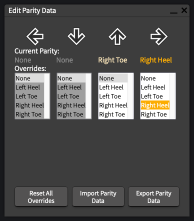
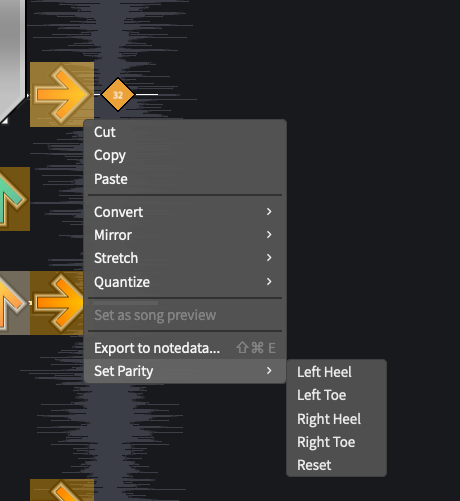

# Step Annotation 

The tl;dr is: I'm trying to make this process as simple as possible. When you load this app, it will load a song from a remote database. Fix the step annotations, and click "Save Step Annotations", and it will save it back to that database. If you want to fix another, click `File > Load New Song...`, and you'll be given another song to fix.

When you load the application, a random song will be loaded, and an initial set of step annotations generated.

This window shows you the current parity settings for the current beat.

 - Current Annotations:
    
   This is the current step annotations for the current beat.
- Overrides:

  This displays what override has been chosen (if any) for a column. Selecting a value will update the chart and the `Current Annotations` setting above.

- Reset All Overrides

  This will clear the _entire chart_ of any parity overrides.

- Save Step Annotations

  This will save the step annotation data to a remote database. If, after saving, you realize that you need to make additional changes, that's fine! Just hit "Save Step Annotations" again, and the database will update your saved annotations.

Besides this window, you can also edit the parity for any note using the context menu. Just right click the note, and select `Set Parity`:

## Some Things to Know
The colors being used are:
- Left Heel = darker blue
- Left Toe = lighter blue
- Right Heel = darker orange
- Right Toe = lighter orange

Rows that have had their parity manually changed will have a red line on the bottom:

## Common Issues 

Here are a couple of known issues to look out for when when correcting the step annotations.
- When a hold note ends on the same row as other notes, it will show up as selectable in the Edit Parity Data window. This is a quirk with how the parity data is stored (the hold note is relevant to how the other notes are hit). 

- Brackets that include the down arrow are almost always given a backwards parity (eg for LD, it will suggest using left heel and left toe, respectively). For the most part, this doesn't create any problems, it's just technically not correct.

- For single notes, this will always choose either "Left Heel" or "Right Heel". No effort is made to decide which part of the foot would be most "correct", it's more just a placeholder for "you'd use some part of your left foot to hit this note".
