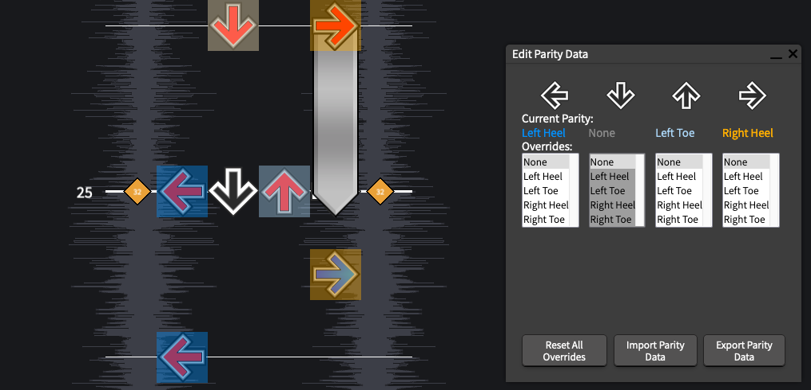
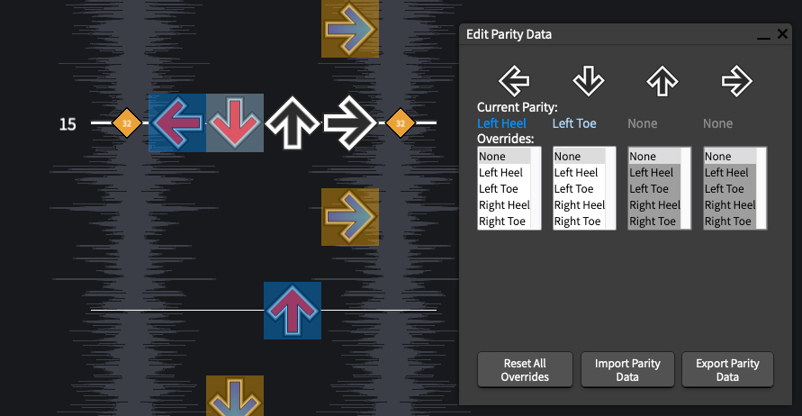

# Step Annotation 

The tl;dr is: I'm trying to make this process as simple as possible. When you load this app, it will load a song from a remote database. Fix the step annotations, and click "Save Step Annotations", and it will save it back to that database. If you want to fix another, click `File > Load New Song...`, and you'll be given another song to fix.

## Okay cool, but why?

The main goal of this project is to refine an algorithm for predicting foot placements for step charts. 

In order to do that, I need to collect lots of data on what "correct" foot placements looks like

and that's why I need help

### What am I doing?
The app will load a random song, and provide you with it's best guess at foot placements. Your job is to check the step chart and correct any foot placements that don't make sense. When you're happy with it, click "Save Step Annotations" to save your corrections.

### How long should this take? 
In practice, I've found that this takes about 5-10 minutes per chart, depending on the chart's difficulty and the accuracy of the predicted foot placements.

### The predicted foot placements look good to me, what should I do?
If you don't think you need to make any corrections, that's great! Please still make sure to hit "Save Step Annotations" before moving onto another song.

## UI

### 1) Song title and Description

This will show you the song title, chart difficulty, and chart description. For some charts, this will contain  a list of [tech notations](https://itgwiki.dominick.cc/en/playstyles/tech/notation) to help you understand what to expect from the chart.

### 2) Note field
This is, of course, the note field. The arrows are highlighted based on the predicted foot placement.

The colors used indicate:
- Left Heel = darker blue
- Left Toe = lighter blue
- Right Heel = darker orange
- Right Toe = lighter orange

Rows that have had their parity manually changed will have a red line on the bottom:

### 3) Edit Foot Placements Window
This window shows you the current foot placement for the current beat.

- Current Foot Placements:

  This is the current foot placement for the current beat.

- Corrections:

  This displays what corrections have been made (if any) for a column. Selecting a value will update the chart and the `Current Foot Placements` above. If you try to select a placement that isn't possible (like selecting two left feet), your selection will be reset.

- Reset All Corrections

  This will clear the _entire chart_ of any corrections that you've made.

- Save Foot Placements

  This will save your data to a remote database. If, after saving, you realize that you need to make additional changes, that's fine! Just hit "Save Foot Placements" again, and the database will update your data.

 

Besides this window, you can also edit the foot placement for any note by right clicking the note and selecting `Correct Foot Placement`:

### 4) Dancing Feet
This is a simple display of the foot placement at the current beat. I'm not sure if this is actually helpful, or just distracting, so it's disabled by default. You can enable by going to `Preferences > Options > General` and checking `Show Dancing Feet`.

## Common Issues 

Here are a couple of known issues to look out for when when correcting the step annotations.
- When a hold note ends on the same row as other notes, it will show up as selectable in the Edit Parity Data window. This is a quirk with how the parity data is stored (the hold note is relevant to how the other notes are hit). 

- Brackets that include the down arrow are almost always given a backwards parity (eg for LD, it will suggest using left heel and left toe, respectively). For the most part, this doesn't create any problems, it's just technically not correct.

- For single notes, this will always choose either "Left Heel" or "Right Heel". No effort is made to decide which part of the foot would be most "correct", it's more just a placeholder for "you'd use some part of your left foot to hit this note".
